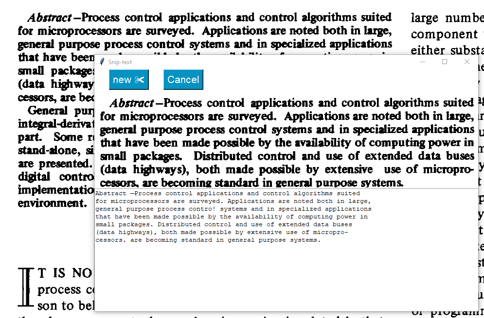

# Snip to Text

This is a simple python project to grab an image from the screen and run text recognition to identify text in it. 

The program uses python tkinter libraries for the GUI and the tesseract OCR api to identify the text. No preprocessing is done to the image, as thesholding appeared to worsen results. 

